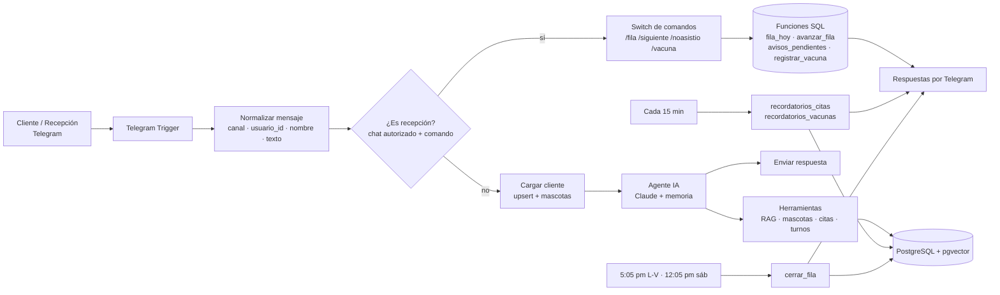

# 🐾 Huellitas Vet — Agente de IA para clínica veterinaria y peluquería canina

Asistente conversacional construido con **n8n + Claude + PostgreSQL** que atiende por chat a los dueños de mascotas de una clínica veterinaria y spa canino: responde dudas, agenda citas, administra una **fila virtual** para consulta general, avisa por mensaje cuando se acerca el turno y envía recordatorios de citas y vacunas.

> **Nota:** *Huellitas Vet* es una marca **ficticia** creada para este proyecto de portafolio. Los datos del negocio (precios, horarios, equipo) son inventados. El problema que resuelve está inspirado en lo que ocurre en muchas clínicas veterinarias locales: atención solo por orden de llegada, esperas largas y clientes que sienten que "se les pasan por delante".

La demo funciona sobre **Telegram**. El diseño separa el canal del resto de la lógica, de modo que migrar a **WhatsApp** implica cambiar solo el disparador y los nodos de envío (ver [Migrar a WhatsApp](#-migrar-a-whatsapp)).

---

## 📑 Contenido

1. [El problema](#-el-problema)
2. [La solución](#-la-solución)
3. [Funcionalidades](#-funcionalidades)
4. [Arquitectura](#-arquitectura)
5. [Stack tecnológico](#-stack-tecnológico)
6. [Modelo de datos](#-modelo-de-datos)
7. [Workflows de n8n](#-workflows-de-n8n)
8. [Herramientas del agente](#-herramientas-del-agente)
9. [Reglas del agente](#-reglas-del-agente)
10. [Reglas de negocio](#-reglas-de-negocio)
11. [Cómo se usa](#-cómo-se-usa)
12. [Instalación](#-instalación)
13. [Decisiones de diseño y lecciones aprendidas](#-decisiones-de-diseño-y-lecciones-aprendidas)
14. [Limitaciones conocidas y próximos pasos](#-limitaciones-conocidas-y-próximos-pasos)
15. [Seguridad](#-seguridad)
16. [Estructura del repositorio](#-estructura-del-repositorio)

---

## 🎯 El problema

Una clínica veterinaria con mucho volumen suele atender **por orden de llegada**. Eso genera:

- Esperas largas y sin información de cuánto falta.
- Quejas por personas que llegaron después y fueron atendidas primero.
- Cirugías, vacunas y peluquería sin una agenda clara.
- Recepción saturada respondiendo siempre las mismas preguntas (horarios, precios, requisitos).
- Olvidos: ayuno antes de cirugía, vacunas de refuerzo, citas no recordadas.

## ✅ La solución

Un modelo **híbrido**:

| Servicio | Cómo se atiende |
|---|---|
| Peluquería, vacunación, desparasitación, esterilización, profilaxis dental | **Con cita**, con horarios reales y control de cruces |
| Consulta general | **Turno virtual** del día, por orden de llegada, con número, personas por delante y espera estimada |
| Urgencias | Nunca pasan por turno: el agente indica acudir de inmediato |

El cliente lo hace todo desde el chat. Recepción maneja la fila con comandos simples.

## ✨ Funcionalidades

**Para el cliente (conversación natural)**
- Información del negocio con **RAG**: precios, horarios, servicios, equipo, ubicación, requisitos e instrucciones.
- Registro de mascotas (nombre, especie, tamaño, raza, edad) y reconocimiento automático del cliente.
- Consulta de disponibilidad y **agendamiento de citas** con duración según el tamaño del perro.
- **Cancelar y reagendar** citas (reserva primero la hora nueva y solo después cancela la anterior).
- **Turno virtual** de consulta general y consulta de "¿cómo va mi turno?".
- Detección de **urgencias** y respuesta inmediata.
- Instrucciones de **ayuno** y cuidados posteriores después de agendar una cirugía.

**Para recepción (comandos por chat)**
- `/fila` ver quién espera.
- `/siguiente` llamar al siguiente turno (avisa al cliente y a quienes ya casi les toca).
- `/noasistio` marcar que el turno llamado no llegó y llamar al siguiente.
- `/vacuna` registrar una vacuna aplicada y programar su recordatorio.

**Automatizaciones**
- Aviso al cliente cuando le quedan **2 turnos o menos**.
- Recordatorio de cita **24 horas** y **2 horas** antes.
- Recordatorio de **ayuno** la noche anterior a una cirugía.
- Recordatorio de **vacunas** 7 días antes de la próxima dosis.
- **Cierre diario** de la fila: los turnos pendientes pasan a `expirado` y se avisa al cliente.
- Manejo de **festivos** (no hay fila ni horarios).

## 🏗️ Arquitectura



**Principio central:** el modelo de lenguaje **conversa**, pero las **reglas de negocio viven en SQL**. El agente nunca calcula fechas, disponibilidad, numeración de turnos ni estados: llama funciones de la base de datos y repite lo que devuelven.

## 🧰 Stack tecnológico

| Componente | Uso |
|---|---|
| **n8n 2.x** (self-hosted, EasyPanel) | Orquestación, agente y automatizaciones |
| **Claude (Anthropic Chat Model)** | Cerebro del agente |
| **PostgreSQL 18 + pgvector** | Datos del negocio, memoria del chat y búsqueda vectorial (RAG) |
| **Gemini Embeddings** (`models/gemini-embedding-001`) | Vectorización de la base de conocimiento |
| **Telegram Bot API** | Canal de la demo |
| **Postgres Chat Memory** | Memoria de conversación por cliente |

## 🗄️ Modelo de datos

| Tabla | Para qué sirve |
|---|---|
| `clientes` | Un registro por cliente y canal. Único por (`canal`, `usuario_id`) |
| `mascotas` | Mascotas de cada cliente (nombre, especie, tamaño, sexo, peso, raza, edad) |
| `servicios` | Catálogo con código, tipo, profesional, días, horarios, duración por tamaño y cupos por día |
| `citas` | Citas agendadas, con estado (`agendada`, `completada`, `cancelada`, `no_asistio`) y banderas de recordatorio |
| `turnos` | Fila virtual diaria (`en_espera`, `llamado`, `atendido`, `no_asistio`, `expirado`) |
| `vacunas` | Vacunas aplicadas, fecha de la próxima dosis y bandera de recordatorio |
| `festivos` | Fechas sin atención |
| `huellitas_memoria` | Memoria del chat del agente |
| Tabla de documentos (PGVector) | Fragmentos de la base de conocimiento con sus *embeddings* |

**Servicios incluidos en la demo:** `bano_completo`, `bano_corte`, `bano_gato`, `vacuna`, `desparasitacion`, `esterilizacion`, `profilaxis`.

**Funciones SQL (la lógica de negocio):**

| Función | Qué hace |
|---|---|
| `horarios_libres(servicio, fecha, tamaño)` | Huecos libres sin cruces, respetando cupos, duración y festivos |
| `fila_abierta()` | ¿La fila virtual está abierta ahora? (horario, domingo y festivos) |
| `pedir_turno(cliente, mascota, motivo)` | Asigna el siguiente número del día (con bloqueo para evitar duplicados) |
| `mi_turno(cliente)` | Estado del turno: número, personas por delante y espera estimada |
| `fila_hoy()` | Lista de turnos del día en espera o llamados |
| `avanzar_fila('siguiente' \| 'noasistio')` | Cierra el turno llamado y llama al siguiente |
| `avisos_pendientes()` | Clientes a quienes les quedan 2 turnos o menos, sin repetir aviso |
| `cerrar_fila()` | Marca como `expirado` los turnos pendientes del día |
| `mis_citas(cliente)` | Citas futuras agendadas del cliente |
| `cancelar_cita(cliente, cita)` | Cancela solo citas propias, agendadas y con más de 2 horas de anticipación |
| `recordatorios_citas()` | Citas a las que toca avisar (24 h, 2 h y ayuno) |
| `recordatorios_vacunas()` | Vacunas próximas a vencer |
| `registrar_vacuna(texto)` | Registra una vacuna desde el comando de recepción |

## 🔁 Workflows de n8n

| Workflow | Función |
|---|---|
| **Agente principal (Telegram)** | Recibe mensajes, distingue cliente de recepción y ejecuta el agente o los comandos |
| **Cierre diario** | Cron L-V 5:05 pm y sábados 12:05 pm: expira turnos pendientes y avisa |
| **Recordatorios** | Cada 15 minutos: recordatorios de citas, ayuno y vacunas |
| **Cargar base de conocimiento** | Ejecución manual: carga el documento del negocio al almacén vectorial |
| **Setup SQL** | Ejecución manual: crea tablas y funciones (se usa una sola vez) |

**Flujo del agente principal:**

```
Telegram Trigger → Normalizar mensaje → ¿Es recepción?
   ├─ sí → Comando recepción (Switch)
   │        ├─ fila       → Consultar fila → Enviar fila
   │        ├─ siguiente  ┐
   │        ├─ noasistio  ┴→ Avanzar fila → ¿Hay turno?
   │        │                  ├─ sí → Avisar al cliente llamado → Confirmar a recepción
   │        │                  │        → Avisos pendientes → Avisar cercanía
   │        │                  └─ no → Fila vacía
   │        ├─ vacuna     → Registrar vacuna → Confirmar vacuna
   │        └─ otro       → Ayuda de comandos
   └─ no → Cargar cliente → Agente Huellitas → Enviar respuesta
```

## 🛠️ Herramientas del agente

| Herramienta | Tipo | Descripción |
|---|---|---|
| `consultar_info_negocio` | Vector Store | Búsqueda semántica en la base de conocimiento |
| `registrar_mascota` | Postgres | Registra una mascota del cliente |
| `consultar_disponibilidad` | Postgres | Horarios libres de un servicio en una fecha |
| `agendar_cita` | Postgres | Agenda con validación de cruces; devuelve `AGENDADA` o `NO_DISPONIBLE` |
| `pedir_turno` | Postgres | Pide turno virtual: `TURNO_ASIGNADO`, `YA_TIENE_TURNO` o `FILA_CERRADA` |
| `consultar_mi_turno` | Postgres | Estado del turno del cliente |
| `mis_citas` | Postgres | Lista las citas futuras con su `id` |
| `cancelar_cita` | Postgres | `CANCELADA`, `MUY_TARDE`, `NO_ENCONTRADA` o `YA_NO_ESTA_AGENDADA` |

El identificador del cliente (`cliente_id`) **nunca lo decide el modelo**: sale del nodo que carga al cliente. Así un cliente no puede consultar ni cancelar citas ajenas.

## 📜 Reglas del agente

El *prompt* del sistema se organiza en reglas numeradas:

| Regla | Contenido |
|---|---|
| 1 | **Urgencias**: prioridad máxima, indicar acudir de inmediato sin hacer preguntas |
| 2 | **Información del negocio**: siempre vía RAG, nunca inventar datos |
| 3 | **Precios que dependen de la mascota** (tamaño, especie, sexo, peso) |
| 4 | **Salud**: sin diagnósticos ni dosis; sugerir consulta |
| 5 | **Agendar citas**: pasos obligatorios (identificar mascota y servicio, consultar disponibilidad, confirmar y agendar; confirmar solo si la herramienta devolvió `AGENDADA`) |
| 6 | **Mascotas**: usar las registradas, no duplicar |
| 7 | **Turno virtual** de consulta general |
| 8 | **Cancelar y cambiar citas**, con orden estricto de pasos |

Además, el *prompt* incluye la fecha y hora actuales y un **calendario de 14 días** con "HOY" y "MAÑANA" marcados.

## 📏 Reglas de negocio

- **Fila virtual:** lunes a viernes 8:00–17:00 y sábados 8:00–12:00. Domingos y festivos cerrada. Se reinicia cada día.
- **Un turno por cliente por día.** Espera estimada: unos 30 minutos por persona delante (un cálculo aproximado, no una hora exacta).
- **Citas:** huecos cada 30 minutos; la duración depende del tamaño del perro; cupos por día para cirugías.
- **Cancelación:** hasta 2 horas antes. Después, el cliente debe hablar con recepción.
- **Recordatorios de cita:** 24 h (ventana de 23 a 24 h antes) y 2 h (ventana de 1 a 2 h antes). Ayuno desde las 8 pm del día anterior.
- **Vacunas:** aviso 7 días antes de la próxima dosis, entre las 8 am y las 6 pm.
- **Cierre diario:** a las 5:05 pm (L-V) y 12:05 pm (sáb), los turnos pendientes pasan a `expirado`.

## 💬 Cómo se usa

### Como cliente

Ejemplos de conversación:

```
Cliente: Quiero un turno para consulta general, Luna tiene tos
Bot:     Listo, tu turno es el 3. Hay 2 personas delante y la espera estimada es de
         unos 60 minutos (aproximada). Te avisaré por aquí cuando falten pocos turnos.

Cliente: ¿Cuánto me falta?
Bot:     Vas en el turno 3, hay 1 persona antes que tú.

Cliente: Quiero un baño completo para Luna el viernes
Bot:     [consulta disponibilidad] Tengo 8:00, 10:00, 12:00 y 14:00. ¿Cuál prefieres?

Cliente: Quiero cambiar la esterilización de Luna para el jueves
Bot:     [consulta, agenda la nueva hora, cancela la anterior y confirma en un solo mensaje]
```

### Como recepción

| Comando | Qué hace |
|---|---|
| `/fila` | Lista los turnos del día con cliente, mascota y motivo |
| `/siguiente` | Marca como atendido al turno actual y llama al siguiente. Avisa al cliente llamado y a quienes ya casi les toca |
| `/noasistio` | Marca que el turno llamado no llegó y llama al siguiente |
| `/vacuna idCliente Mascota Vacuna días` | Registra una vacuna aplicada hoy; la próxima dosis queda a `días` de distancia |
| `/ayuda` | Muestra la lista de comandos |

Ejemplo: `/vacuna 123456789 Luna Quíntuple 365`

> `idCliente` es el identificador del cliente en el canal (en Telegram, su chat id; en WhatsApp será su número).

## ⚙️ Instalación

### Requisitos

- n8n 2.x autoalojado (con acceso a Postgres).
- PostgreSQL con la extensión **pgvector** (imagen `pgvector/pgvector` con la misma versión mayor de Postgres).
- Un bot de Telegram (creado con `@BotFather`).
- Claves de API de **Anthropic** y de **Google Gemini** (embeddings).

### Pasos

1. **Base de datos.** Crea una base (por ejemplo `portafolio_veterinaria`) en una instancia de Postgres con pgvector.
2. **Variables de n8n.** Define la zona horaria (`GENERIC_TIMEZONE` y `TZ` en `America/Bogota`) y una `N8N_ENCRYPTION_KEY` **fija** y respaldada.
3. **Credenciales en n8n:** Telegram, Postgres, Anthropic y Google Gemini.
4. **Importar los workflows** de la carpeta [`workflows/`](workflows/).
5. **Crear tablas y funciones.** Ejecuta en orden los scripts de [`sql/`](sql/) (desde `psql` o con el workflow *Setup SQL*). Hay instrucciones en [`sql/README.md`](sql/README.md).
6. **Cargar la base de conocimiento** con el workflow *Cargar base de conocimiento*, a partir de [`docs/base-de-conocimiento.md`](docs/base-de-conocimiento.md).
7. **Ajustar** el chat id de recepción en el nodo `¿Es recepción?`.
8. **Zona horaria por workflow:** en *Settings* de cada workflow, `America/Bogota`.
9. **Publicar** el agente principal, el cierre diario y los recordatorios.

### Comprobación rápida

1. Escribe "hola" al bot: debe responder.
2. `/ayuda` desde el chat de recepción: debe mostrar los comandos.
3. Pide un turno y pulsa `/fila`: debe aparecer en la lista.
4. En *Executions* de `Recordatorios` debe aparecer una ejecución cada 15 minutos.

## 🧠 Decisiones de diseño y lecciones aprendidas

- **El modelo no calcula fechas.** El *prompt* recibe un calendario de 14 días ya resuelto. Los nodos de código usan la zona horaria de Bogotá explícitamente.
- **Las reglas de negocio viven en SQL, no en el prompt.** Un prompt se puede "interpretar"; una función SQL no.
- **Las herramientas siempre devuelven una fila.** Con agregaciones o consultas con `CASE`, para que el agente nunca entre en un bucle esperando respuesta.
- **El agente no inventa confirmaciones.** Solo dice "agendada" o "cancelada" si la herramienta devolvió el código esperado (`AGENDADA`, `CANCELADA`).
- **Parámetros opcionales con un valor centinela.** Un parámetro vacío al final se pierde en la consulta; se envía `-` y se convierte con `NULLIF`.
- **Datos conocidos no pasan por el modelo.** El `cliente_id` sale de un nodo, no del modelo.
- **Colisiones controladas con bloqueos.** `pedir_turno` usa un bloqueo consultivo para que dos personas no obtengan el mismo número.
- **Orden estricto al reagendar.** Primero se agenda la hora nueva; solo si queda confirmada se cancela la anterior. Los pasos de la regla 8 son explícitos porque un primer intento sin ellos dejó dos citas activas.
- **Envoltorio en lugar de reescritura.** Para añadir festivos a `horarios_libres` se renombró la función original y se creó una con el mismo nombre que la llama, así nada de lo que dependía de ella se rompió.
- **Pruebas con datos conocidos.** Al probar comandos de actualización, usar siempre el `id` real en vez de un marcador (un `WHERE id = ID` afectó todas las filas).

## 🚧 Limitaciones conocidas y próximos pasos

- La demo usa Telegram. Falta la integración con WhatsApp Business.
- Los festivos se cargan a mano; hay que completar cada año.
- Las vacunas aplicadas las registra recepción con `/vacuna`; no hay integración con un sistema clínico.
- La espera estimada del turno es un promedio simple (30 minutos por persona).
- No hay tablero visual para recepción (todo es por comandos).
- Ideas futuras: recordatorio de baño cada 4 a 6 semanas, encuestas de satisfacción, resumen diario de ocupación.

## 🔐 Seguridad

- **No subas credenciales ni claves** al repositorio. Al exportar workflows desde n8n verifica que no incluyan datos sensibles.
- Mantén la `N8N_ENCRYPTION_KEY` fuera del código y en un lugar seguro. Si se expone, rótala y vuelve a crear las credenciales.
- Los datos de la demo (clientes, mascotas, teléfonos) son de prueba. Si lo usas con datos reales, aplica la normativa de protección de datos personales que corresponda.
- Los comandos de recepción solo se aceptan desde los chats autorizados.

## 📁 Estructura del repositorio

```
huellitas-vet/
├── README.md                     ← este documento
├── LICENSE
├── docs/
│   ├── base-de-conocimiento.md   ← datos ficticios del negocio (fuente del RAG)
│   ├── prompt-del-agente.md      ← reglas del prompt del sistema
│   └── img/                      ← capturas del bot y de los flujos
├── sql/
│   ├── 00_extensiones.sql
│   ├── 01_tablas.sql
│   ├── 02_funciones_citas.sql
│   ├── 03_funciones_turnos.sql
│   └── 04_funciones_recordatorios.sql
└── workflows/
    ├── agente-principal.json
    ├── cierre-diario.json
    ├── recordatorios.json
    ├── cargar-base-de-conocimiento.json
    └── setup-sql.json
```

## 🔄 Migrar a WhatsApp

Todo lo que importa (tablas, funciones, herramientas, reglas del agente) usa solo `cliente_id` y `usuario_id`, nunca nada propio de Telegram. Para pasar a WhatsApp:

1. Cambiar el **disparador** de entrada.
2. Ajustar **Normalizar mensaje** para que `usuario_id` sea el número de WhatsApp y `canal` valga `whatsapp`.
3. Reemplazar los **nodos de envío** (agente, recepción, cierre diario y recordatorios). El *Chat ID* ya sale de `usuario_id`.

## 📸 Capturas

> Añade aquí capturas en `docs/img/`: conversación de turno virtual, agendamiento de cita, `/fila` y `/siguiente`, y el lienzo del workflow principal.

## 👤 Autor

Proyecto de portafolio de automatización con IA. *[Tu nombre · enlace a tu perfil de GitHub o LinkedIn]*

## 📄 Licencia

MIT — ver [`LICENSE`](LICENSE). *(Reemplaza `[Tu nombre]` en ese archivo.)*
